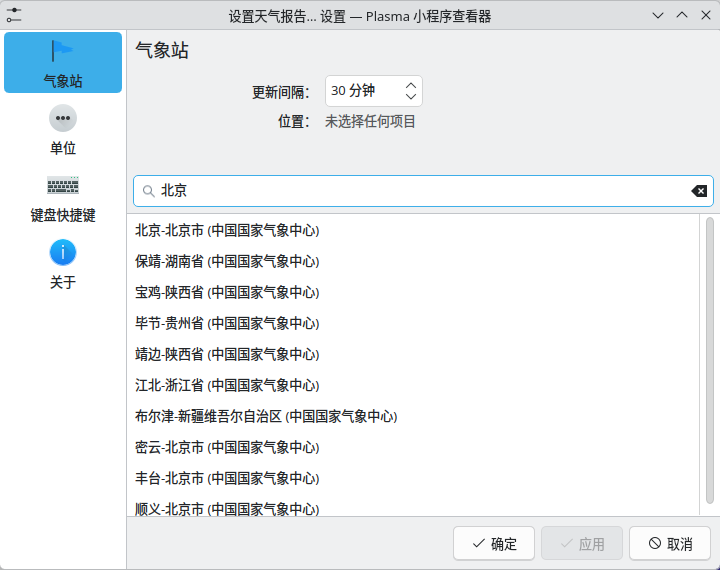
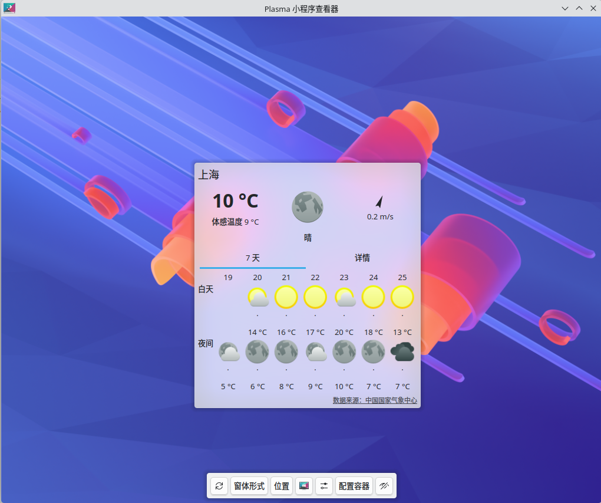

# Plasma Weather China Sources

<p align="center">
   <br>
   
   
   <br>
</p>

A collection of ions for Chinese users.

## What is Ion

Ion is KDE's weather source engine, which can provide weather data to its weather widget (org.kde.plasma.weather).
KDE itself has some Ions, like `wetter.com`, `noaa`, etc. If you have used the weather widget, you will not miss them.

## Why create this

Although KDE itself has some Ions, they are not suitable for Chinese users. Only a few cities can be found and their reports are too brief.
That's why this project is created. We collect some weather apis focus on Chinese cities so we can have a better experience when using KDE's weather widget.

## Usage

You should be able to search Chinese cities and obtain weather report in KDE's weather widget after installed this.

1. Install [dependencies](#dependencies)
2. Clone this repository using git or downloading archive
3. Build and install the project:

   ```bash
   cmake -B build -S "/path/to/plasma-ions-china \
      -DCMAKE_BUILD_TYPE=Release \
      -DPlasmaWeather_ROOT=/path/to/plasma-ions-china"
   cmake --build  build
   cmake --install build
   ```

   Available cmake options to control configuring:
   - `PLASMA_IONS_CHINA_ENABLE_MODERN`: If enable modern ions used for KDE >= 6.5, defaults to `ON`.
   - `PLASMA_IONS_CHINA_ENABLE_LEGACY`: If enable legacy ions used for KDE < 6.5, defaults to `OFF`.

   There is no need to set `CMAKE_INSTALL_PREFIX`, because it will follow KDE's and not be configurable. That means most of the time it is `/usr`.
   Because of this, it is strongly recommended that you should create a package for your Linux Distribution.

   Setting `PlasmaWeather_ROOT` is required due to that kdeplasma-addons does not provide headers for `libplasmaweatherion.so` and `libplasmaweatherdata.so`.
   If you find your Linux Distribution provides those headers with filesystem hierarchy like [include](./include),
   it is recommended to omit/update this value to use headers in your system.

4. Open KDE's weather widget (org.kde.plasma.weather) and search Chinese cities like Beijing, etc.

   For just experiencing, you can run `plasmoidviewer -a org.kde.plasma.weather` after you installed `plasma-sdk`.

### Dependencies

#### Runtime dependencies

- qt6-base
- plasma-workspace < 6.5 OR kdeplasma-addons >= 6.5

#### Buildtime extra dependencies

- cmake
- extra-cmake-modules
- git (If you want to automatically set project version from git tag)

## Ions

|Name|Description|Comment|Reverse Engineered|Modern|Legacy|
|----|-----------|-------|------------------|------|------|
|nmccn|The ion uses api from www.nmc.cn to obtain weather report|The passed daytime report is not available when is night.|Y|[Y](./src/nmccn)|[Y](./src/plasma_engine_nmccn)|

## Adding new ion

We take `nmccn` as an example here about how to add a new ion:

1. Prepare a id for your ion.

   We are using `nmccn` here.

2. Add your ions to cmake.

   Modify [src/CMakeLists.txt](./src/CMakeLists.txt), add the id you chosen to the list `ION_NAMES`.

   See [CMake Documentation](https://cmake.org/cmake/help/latest/command/set.html#set-normal-variable) for how to update it correctly. 

3. Create directory to storage sources in [src](./src).

   We created `nmccn` and `plasma_engine_nmccn` here to storage modern and legacy versions of ion.
   Modern ions should use the id, while legacy ions must prefix id with `plasma_engine_`.

   Both directories are optional, we only add your directory if it really exists.

4. Create `CMakeLists.txt` for your directories.

   Directories created at step above are added only when they have a `CMakeLists.txt` file.
   You must create a target which name is the directory in the file.
   For example, [`nmccn/CMakeLists.txt`](./src/nmccn/CMakeLists.txt) will create a target named `nmccn`,
   while [`plasma_engine_nmccn/CMakeLists.txt`](./src/plasma_engine_nmccn/CMakeLists.txt) will create a target named `plasma_engine_nmccn`.

   We add target definition `KDE_WEATHER_TRANSLATION_DOMAIN` to the ion target based on the ion type.

   In the `CMakeLists.txt` of modern ion, you must add target by using instruction `kcoreaddons_add_plugin` and set `INSTALL_NAMESPACE` to `${ION_INSTALL_NAMESPACE}`.
   The added target must link to target `Plasma::Weather::Ion`.

   In the `CMakeLists.txt` of legacy ion, you can use the standard `add_library` command to add target.
   But you must set `DESTINATION` to `${PLASMA5SUPPORT_DATAENGINES_PLUGINDIR}` in `install` instruction.
   The added target must link to target `Plasma::Weather::IonLegacy`.

   In the `CMakeLists.txt` of both ions, you can use `ecm_qt_declare_logging_category` to generate logger function for using in `qDebug`, `qWarning`, etc.
   You can also use commands like `find_package`, `target_link_libraries`, etc to customize your ions targets.

5. Create metadata for your ions.

   Metadata is a json file, which will be used by macro `K_PLUGIN_CLASS_WITH_JSON`.

   For modern ion, it looks like this like in [nmccn/metadata.json](./src/nmccn/metadata.json):
   ```json
   {
      "KPlugin": {
         "Description": "My custom ion",
         "Description[$LANG]": "Translated into $LANG of `My custom ion`",
         "Icon": "example-icon-name",
         "Name": "Custom",
         "Name[$LANG]": "Translated into $LANG of `Custom`"
      },
      "Comment": "Some comments about the ion",
      "Quality": 1
   }
   ```
   The `$LANG` is the language code like `zh_CN`, etc and optional.

   For legacy ion, it looks like this like in [plasma_engine_nmccn/metadata.json](./src/plasma_engine_nmccn/metadata.json):
   ```json
   {
      "KPlugin": {
         "Description": "My custom ion",
         "Description[$LANG]": "Translated into $LANG of `My custom ion`",
         "Icon": "example-icon-name",
         "Name": "Custom",
         "Name[$LANG]": "Translated into $LANG of `Custom`"
      },
      "X-KDE-ParentApp": "weatherengine"
   }
   ```
   The `$LANG` is the language code like `zh_CN`, etc and optional.

   Save the metadata in a json file, like `metadata.json`.

6. Add source code.

   You need to use `#include <ion.h>` to introduce `IonInterface` or `Ion` based on the target you link your ion to.
   This file is provided by `Plasma::Weather::IonLegacy` or `Plasma::Weather::Ion` based on your cmake instruction.

   You need to use `K_PLUGIN_CLASS_WITH_JSON` after added `#include <KPluginFactory>` in your source code to embed the metadata created above into library.

   For modern ion, see [ion.h](./include/plasma/weather/ion.h) for more about `Ion`.
   You need to implement those methods:
   - `void Ion::findPlaces(std::shared_ptr<QPromise<std::shared_ptr<Location>>> promise, const QString &searchString)`
   - `void Ion::fetchForecast(std::shared_ptr<QPromise<std::shared_ptr<Forecast>>> promise, const QString &placeInfo)`


   For legacy ion, see [ion.h](/usr/include/plasma5support/weather/ion.h) for more about `IonInterface`,
   see [Ions](https://techbase.kde.org/Projects/Plasma/Weather/Ions) for more about the `source` and how to respond.
   You need to implement those methods:
   - `void IonInterface::reset()`
   - `bool IonInterface::updateIonSource(const QString &source)`

   After installed built libraries, you can use `plasmoidviewer -a org.kde.plasma.weather` to see if your ion works in actual situation.
   If you just want to check your legacy ion, you can use `plasmaengineexplorer` to do that.
   Both tools are provided by `plasma-sdk`.

   If you need to see your log outputs, you can set environment variable `QT_LOGGING_RULES=${LOGGING_CATEGORY}.debug=true` to `plasmaengineexplorer` or `plasmoidviewer`.
   `${LOGGING_CATEGORY}` is the `CATEGORY_NAME` when you use `ecm_qt_declare_logging_category` to generate logger function.

7. Update translation template and the translations

   We use gettext to provide a localized user interface.
   You need to run command like `xgettext -o po/plasma_ions_china.pot -d plasma_ions_china -C -ki18n src/**/*.cpp` to update translation template.
   We have also added 2 cmake targets: `update-pot` and `update-po` to update them accordingly.
   Feel free to use `cmake --build <build-dir> --target <target-name>` to let cmake generate updated translation files.
   If you are familiar with some languages, it is also recommended to update the corresponding `po` files.

8. Update documentation

   You need to update [Ions](#ions) table in this README by following existing entries.
